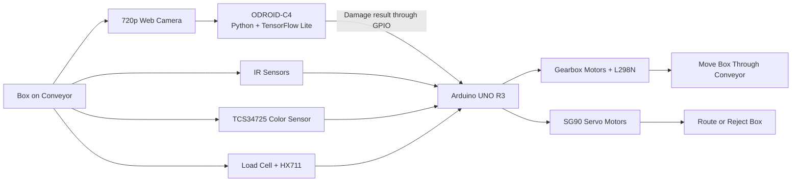

# AI-Assisted Conveyor Sorting System

An embedded-system prototype that sorts boxes by **color, weight, and damage status**.

An Arduino UNO R3 controls the conveyor, sensors, motors, and servo mechanisms. An ODROID-C4 processes images from a webcam using a TensorFlow Lite classification model and sends the damage result to the Arduino through a GPIO signal.

The system accepts boxes that match the supported weight and color conditions, routes them to the appropriate sorting position, and rejects boxes with an invalid weight or visible damage.

---

## System Architecture



---

## How the System Works

1. **Package detection**  
   The first IR sensor detects a box entering the conveyor. It is handled through an interrupt and can wake the Arduino from power-down sleep mode.

2. **Data collection**  
   The system reads the box color using a TCS34725 sensor and measures its weight using a 1 kg Load Cell with an HX711 module.

3. **Damage classification**  
   A webcam sends an image to the ODROID-C4. The Python program loads a TensorFlow Lite model and classifies the box as `good` or `damage`.

4. **Arduino and ODROID communication**  
   The ODROID-C4 sends the classification result to the Arduino through a GPIO signal:
   - `0` — good
   - `1` — damaged

5. **Queue-based tracking**  
   The Arduino stores each box's color, weight category, and damage status as an object in a queue. This allows the controller to keep track of multiple boxes moving through different conveyor positions.

6. **Sorting decision**  
   Damaged boxes and boxes with an unsupported weight are rejected. Valid boxes are routed according to their weight category and detected color.

7. **Actuator control**  
   Gearbox motors move the conveyor, while servo motors switch lanes and push boxes into the appropriate output positions.

---

## AI Damage Detection

The image-classification model was trained using **Teachable Machine** and exported as:

```text
model.tflite
labels.txt
```

The `box.py` program runs on the ODROID-C4 and performs the following steps:

1. Captures an image from the webcam
2. Preprocesses the image for the TensorFlow Lite model
3. Runs image classification
4. Determines whether the box is good or damaged
5. Sends the result to the Arduino through GPIO

The AI component is used only for box-condition classification. Color and weight are measured using dedicated hardware sensors.

---

## Embedded Control Design

### Sensor Handling

- **IR1:** handled through an interrupt for package entry detection and wake-up
- **IR2–IR9:** checked through sensor polling
- **TCS34725:** reads supported box colors
- **Load Cell + HX711:** measures box weight
- **ODROID GPIO input:** provides the box-damage result to the Arduino

### Package Data

Each tracked box stores information similar to:

```text
color
weight
damage status
```

The queue keeps this information in the same order as the boxes moving through the conveyor.

### Power Management

The Arduino can enter power-down sleep mode while no package is entering the system. Detection from the first IR sensor wakes the controller so processing can continue.

---

## Hardware

| Category | Components |
|---|---|
| **Main Controller** | Arduino UNO R3 |
| **AI Processing** | ODROID-C4 |
| **Camera** | 720p Web Camera |
| **Color Detection** | TCS34725 Color Sensor |
| **Weight Detection** | 1 kg Load Cell and HX711 |
| **Position Detection** | 9 Infrared Sensors |
| **Servo Control** | 5 SG90 Servo Motors |
| **Conveyor Movement** | 4 Gearbox Motors |
| **Motor Drivers** | 2 L298N Motor Drivers |
| **I/O Expansion** | PCF8574 |

---

## Technologies

| Area | Technologies |
|---|---|
| **Embedded Programming** | Arduino, C/C++ |
| **AI Processing** | Python, TensorFlow Lite, Teachable Machine |
| **Hardware Communication** | GPIO |
| **Data Management** | Queue Data Structure |
| **Event Handling** | Interrupt and Sensor Polling |
| **Power Management** | Arduino Power-Down Sleep Mode |

---

## Key Source Files

| File | Responsibility |
|---|---|
| `Conveyer_belt.ino` | Main Arduino program |
| `check_color.h` | Reads and classifies box color |
| `check_weight.h` | Reads and classifies box weight |
| `box_damaged_from_odroid.h` | Reads the damage signal from the ODROID-C4 |
| `objectStruct.h` | Defines the data stored for each box |
| `objectManager.h` | Manages tracked box objects |
| `queue_IR2_Manager.h` | Manages the package queue |
| `laneManager.h` | Controls package routing between lanes |
| `motor_control.h` | Controls conveyor motors |
| `servo_control.h` | Controls sorting servo motors |
| `pcf8574_read_ir.h` | Reads IR sensor states through the PCF8574 |
| `sleep.h` | Manages Arduino sleep behavior |
| `box.py` | Runs TensorFlow Lite classification on the ODROID-C4 |

---

## Running the Prototype

This project requires the physical conveyor hardware and cannot be reproduced as a complete system using software alone.

A general setup consists of:

1. Connecting the sensors, motor drivers, motors, servos, Arduino, and ODROID-C4 according to the project's pin configuration
2. Uploading `Conveyer_belt.ino` to the Arduino UNO R3
3. Placing `box.py`, `model.tflite`, and `labels.txt` on the ODROID-C4
4. Connecting the webcam to the ODROID-C4
5. Connecting the ODROID GPIO output to the Arduino input
6. Running the Python classification program on the ODROID-C4
7. Starting the conveyor and testing boxes with the supported conditions

---

## Project Scope

This project was developed as an academic embedded-system prototype.

It demonstrates:

- Integration between an Arduino and a single-board computer
- Sensor-based measurement of color, weight, and package position
- TensorFlow Lite image classification on an ODROID-C4
- GPIO communication between two controllers
- Queue-based tracking of multiple boxes
- Motor and servo control for conveyor routing
- Interrupt, polling, and sleep-mode handling

The prototype was not designed as an industrial production system. Its AI model and sorting rules are limited to the conditions and classes used during project development.