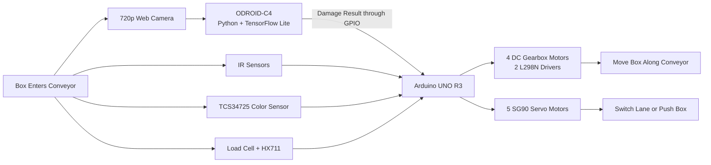
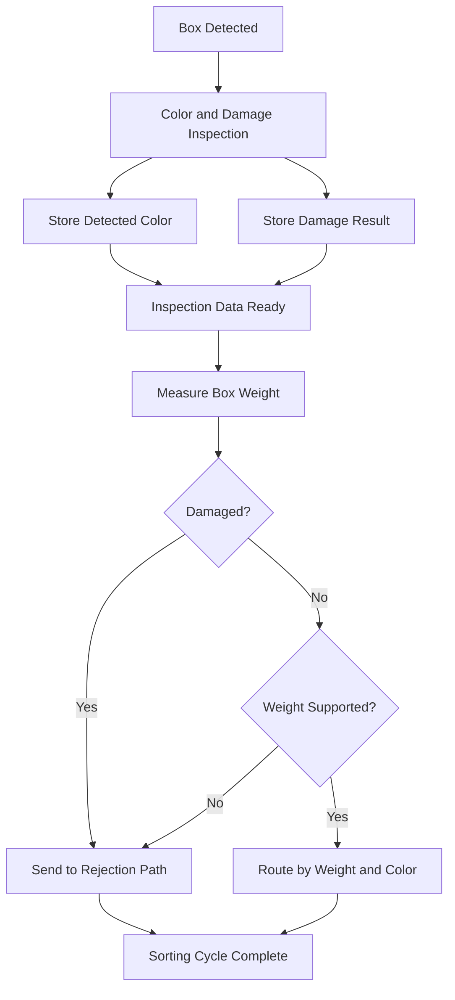

# AI-Assisted Conveyor Sorting System

An embedded-system prototype that sorts boxes by **color, weight, and damage status**.

The Arduino UNO R3 controls the conveyor, sensors, motors, and servo mechanisms. An ODROID-C4 processes webcam images using a TensorFlow Lite model and sends the damage result to the Arduino through GPIO.

The prototype processes **one box per sorting cycle**. The next box should be placed on the conveyor only after the current box has been completely sorted.

---

## System Architecture



---

## How the System Works

1. **Entry detection**  
   The first IR sensor detects a box entering the conveyor. It is handled through an interrupt and can wake the Arduino from power-down sleep mode.

2. **Color detection and damage inspection**  
   The color sensor and AI inspection operate during the same inspection stage:
   - The TCS34725 sensor reads the box color.
   - The webcam captures an image of the box.
   - The ODROID-C4 classifies the box as `good` or `damage`.

3. **GPIO communication**  
   The ODROID-C4 sends the damage result to the Arduino through GPIO:

   ```text
   0 = good
   1 = damage
   ```

4. **Weight measurement**  
   The box then moves to the weight-measurement stage. The Arduino reads a 1 kg Load Cell through the HX711 module and determines the weight category.

5. **Final decision**  
   The Arduino combines the color, weight, and damage results:
   - A damaged box is sent to the rejection path.
   - A box with a weight outside the supported range is also rejected.
   - Other boxes are routed according to their weight category and detected color.

6. **Mechanical sorting**  
   DC gearbox motors move the conveyor. SG90 servo motors switch lanes or push the box into the required sorting or rejection position.

7. **Cycle completion**  
   The next box should be placed on the conveyor only after the current sorting cycle is complete.

---

## Sorting Logic



The damage result can override the normal sorting destination. Even if the color and weight are valid, a damaged box is still rejected.

---

## AI Damage Classification

The image-classification model was trained using **Teachable Machine** and exported as:

```text
model.tflite
labels.txt
```

The `box.py` program runs on the ODROID-C4 and:

1. Captures an image from the webcam
2. Preprocesses the image for the TensorFlow Lite model
3. Runs image classification
4. Determines whether the box is good or damaged
5. Sends the result to the Arduino through GPIO

The AI model is used only for damage classification. Color and weight are measured using dedicated sensors.

---

## Embedded Control Design

### Sensor Handling

- **IR1:** interrupt-based entry detection and wake-up signal
- **IR2–IR9:** polling-based box-position detection
- **TCS34725:** box-color detection
- **Load Cell + HX711:** box-weight measurement
- **ODROID GPIO input:** damage result received by the Arduino

### Box Data

For each sorting cycle, the system stores:

```text
color
weight category
damage status
```

These values belong to the current box and are used when the Arduino makes the final sorting decision.

### Power Management

The Arduino can enter power-down sleep mode when no new box is detected. The first IR sensor wakes the controller when a box enters the system.

---

## Hardware

| Category | Components |
|---|---|
| **Main Controller** | Arduino UNO R3 |
| **AI Processing** | ODROID-C4 |
| **Camera** | 720p Web Camera |
| **Color Detection** | TCS34725 Color Sensor |
| **Weight Detection** | 1 kg Load Cell and HX711 |
| **Position Detection** | 9 Infrared Sensors |
| **Sorting Mechanisms** | 5 SG90 Servo Motors |
| **Conveyor Movement** | 4 DC Gearbox Motors |
| **Motor Control** | 2 L298N Motor Driver Modules |
| **I/O Expansion** | PCF8574 |

---

## Technologies

| Area | Technologies |
|---|---|
| **Embedded Programming** | Arduino, C/C++ |
| **AI Processing** | Python, TensorFlow Lite, Teachable Machine |
| **Controller Communication** | GPIO |
| **Event Handling** | Interrupts and Sensor Polling |
| **Power Management** | Arduino Power-Down Sleep Mode |

---

## Main Source Files

| File | Responsibility |
|---|---|
| `Conveyer_belt.ino` | Main Arduino program |
| `check_color.h` | Reads and classifies box color |
| `check_weight.h` | Reads and classifies box weight |
| `box_damaged_from_odroid.h` | Reads the damage signal from the ODROID-C4 |
| `objectStruct.h` | Defines the stored data for the current box |
| `objectManager.h` | Manages the current box data |
| `laneManager.h` | Controls routing between conveyor lanes |
| `motor_control.h` | Controls the conveyor motors |
| `servo_control.h` | Controls the sorting servos |
| `pcf8574_read_ir.h` | Reads IR sensor states through the PCF8574 |
| `sleep.h` | Manages Arduino sleep behavior |
| `box.py` | Runs TensorFlow Lite classification on the ODROID-C4 |

---

## Running the Prototype

The complete system requires the physical conveyor hardware.

A general setup consists of:

1. Connect the sensors, motors, motor drivers, servos, Arduino, and ODROID-C4 according to the project pin configuration.
2. Upload `Conveyer_belt.ino` to the Arduino UNO R3.
3. Place `box.py`, `model.tflite`, and `labels.txt` on the ODROID-C4.
4. Connect the webcam to the ODROID-C4.
5. Connect the ODROID GPIO output to the Arduino input.
6. Run the Python classification program on the ODROID-C4.
7. Place one box on the conveyor.
8. Wait until the sorting cycle is complete before placing the next box.

---

## Project Scope

This project was developed as an academic embedded-system prototype by a three-person student team.

It demonstrates:

- Arduino and single-board computer integration
- Color detection and AI-based damage classification during the same inspection stage
- Weight measurement after the initial inspection
- GPIO communication between controllers
- Rejection of damaged boxes and boxes outside the supported weight range
- Processing one box per sorting cycle
- Motor and servo control for conveyor sorting
- Interrupt, polling, and sleep-mode handling

The prototype was not designed as an industrial production system. Its AI model, supported colors, weight rules, and sorting behavior are limited to the conditions used during project development.